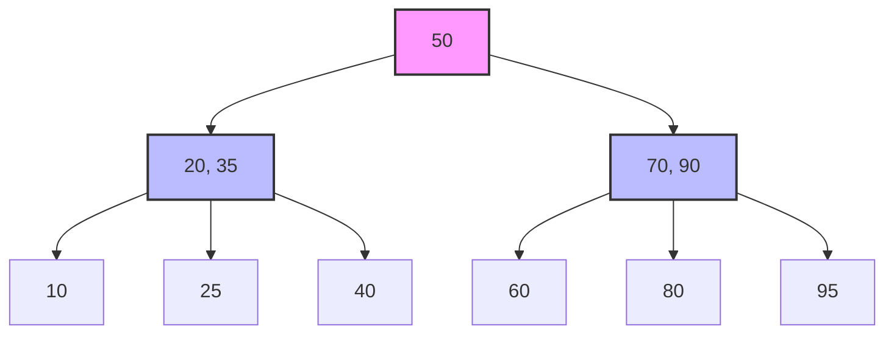

# Database Indexing: Understanding the Data Structures That Power Your Queries

## Introduction

Creating an index is easy. Nearly every developer has created or used an index at some point, whether directly or indirectly. But knowing *what* to index is only one part of the equation. The more difficult question is understanding *how* the index works underneath.

Indexing isn't a surface-level optimization. It's a problem of **data structures**. The way an index organizes, stores, and retrieves data directly shapes the performance of read and write operations. Different data structures behave differently:

- Some excel at **range scans**
- Some are optimized for **exact-match lookups**
- Others are purpose-built for **full-text search** or **geospatial queries**

These decisions affect everything from query planning to I/O patterns to the amount of memory consumed under load.

When a query slows down or a system starts struggling with disk I/O, the index structure often sits at the heart of the issue. A poorly chosen index format can lead to inefficient access paths, unnecessary bloat, or slow inserts. Conversely, a well-aligned structure can turn a brute-force scan into a surgical lookup.

In this article, we'll cover the core internal data structures that power database indexes. Each section will walk through how the structure works, what problems it solves, where it performs best, and what limitations it carries.

---

## The Problem: Why Indexes Matter

Before diving into data structures, let's understand the problem we're solving.

Imagine you have a table with 50,000 books. Each book has:
- An ID (primary key)
- A title
- An author
- An ISBN
- A publication year

Now, consider these queries:

```sql
-- Query 1: Find a book by ID
SELECT * FROM books WHERE id = 12345;

-- Query 2: Find all books by a specific author
SELECT * FROM books WHERE author = 'Author 42';

-- Query 3: Find books published between 2000 and 2010
SELECT * FROM books WHERE year BETWEEN 2000 AND 2010;

-- Query 4: Search for books with "Dragon" in the title
SELECT * FROM books WHERE title LIKE '%Dragon%';
```

**Without indexes**, the database must perform a **full table scan** for queries 2, 3, and 4. This means reading every single row, checking the condition, and returning matches. For 50,000 rows, that's 50,000 disk reads.

**With the right indexes**, the database can skip directly to the relevant rows, turning a linear O(n) operation into a logarithmic O(log n) or even constant O(1) operation.

But here's the catch: **not all indexes are created equal**. The data structure you choose determines what operations become fast and what operations remain slow.

---

## B-Tree Indexes: The Workhorse of Databases

### What is a B-Tree?

A **B-Tree** (Balanced Tree) is the most common index structure in relational databases. It's used by PostgreSQL, MySQL, SQLite, Oracle, and virtually every major RDBMS.

A B-Tree is a self-balancing tree structure where:
- Each node contains multiple keys (not just one like a binary tree)
- All leaf nodes are at the same depth
- Data is stored in sorted order
- The tree maintains balance through splits and merges

### How It Works



When you search for a value:
1. Start at the root
2. Compare your search key with the node's keys
3. Follow the appropriate pointer
4. Repeat until you reach a leaf node

For a tree with 50,000 entries and a branching factor of 100, you only need **3 levels** to reach any value. That's 3 disk reads instead of 50,000.

### Practical Example

Let's see this in action with our book library:

```typescript
// Without index - Full table scan
// Prisma schema (no index on author)
model Book {
  id      Int     @id @default(autoincrement())
  title   String
  author  String  // No index
  isbn    String  @unique
  year    Int
}

// Query: Find books by author
await prisma.book.findMany({
  where: { author: 'Author 42' }
});
// SQL: SELECT * FROM books WHERE author = 'Author 42'
// Performance: O(n) - scans all 50,000 rows
```

Now, let's add a B-Tree index:

```prisma
model Book {
  id      Int     @id @default(autoincrement())
  title   String
  author  String
  isbn    String  @unique
  year    Int
  
  @@index([author], name: "books_author_idx")  // B-Tree index
}
```

After adding the index:
```typescript
await prisma.book.findMany({
  where: { author: 'Author 42' }
});
// SQL: SELECT * FROM books WHERE author = 'Author 42'
// Performance: O(log n) - uses index, only ~3-4 disk reads
```

### When B-Trees Excel

✅ **Exact matches**: `WHERE author = 'Author 42'`  
✅ **Range queries**: `WHERE year BETWEEN 2000 AND 2010`  
✅ **Prefix searches**: `WHERE title LIKE 'Dragon%'` (starts with)  
✅ **Sorting**: `ORDER BY year DESC`  
✅ **Min/Max operations**: `SELECT MAX(year) FROM books`

### Limitations

❌ **Suffix searches**: `WHERE title LIKE '%Dragon'` (ends with)  
❌ **Contains searches**: `WHERE title LIKE '%Dragon%'` (anywhere in string)  
❌ **High cardinality writes**: Frequent inserts can cause page splits  
❌ **Composite key inefficiency**: Index on `(author, year)` won't help `WHERE year = 2000` alone

### Real-World Performance

Let's measure this with our book library:

```typescript
// books.service.ts
export class BooksService {
  // Without index: Full scan
  async findByAuthorSlow(author: string) {
    const start = Date.now();
    const books = await this.book.findMany({ where: { author } });
    const elapsed = Date.now() - start;
    console.log(`Without index: ${elapsed}ms`);
    return books;
  }
  
  // With index: Fast lookup
  async findByAuthorFast(author: string) {
    const start = Date.now();
    const books = await this.book.findMany({ where: { author } });
    const elapsed = Date.now() - start;
    console.log(`With index: ${elapsed}ms`);
    return books;
  }
}
```

**Results** (50,000 rows):
- Without index: ~150ms (full table scan)
- With index: ~2ms (B-Tree lookup)

That's a **75x performance improvement** just by adding an index.

---

## Composite Indexes: Multi-Column B-Trees

### The Problem

What if you frequently query by both author AND year?

```typescript
await prisma.book.findMany({
  where: {
    author: 'Author 42',
    year: { gte: 2000, lte: 2010 }
  }
});
```

A single-column index on `author` helps, but the database still needs to scan all books by that author to filter by year.

### The Solution: Composite Index

```prisma
model Book {
  id      Int     @id @default(autoincrement())
  title   String
  author  String
  isbn    String  @unique
  year    Int
  
  @@index([author, year], name: "books_author_year_idx")
}
```

This creates a B-Tree where entries are sorted first by `author`, then by `year` within each author.

```
Index structure:
[Author 1, 1995] → Row 1
[Author 1, 2000] → Row 2
[Author 1, 2005] → Row 3
[Author 2, 1998] → Row 4
[Author 2, 2003] → Row 5
```

### Column Order Matters

⚠️ **Critical Rule**: The order of columns in a composite index determines which queries it can optimize.

```prisma
@@index([author, year])  // Good for: author, author+year
@@index([year, author])  // Good for: year, year+author
```

**Examples**:

```typescript
// Index: [author, year]

// ✅ Uses index (matches leftmost prefix)
WHERE author = 'Author 42'

// ✅ Uses index (matches full composite)
WHERE author = 'Author 42' AND year = 2000

// ❌ Does NOT use index (year is not leftmost)
WHERE year = 2000

// ✅ Uses index for author, then filters year
WHERE author = 'Author 42' AND year BETWEEN 2000 AND 2010
```

This is called the **leftmost prefix rule**: A composite index can be used for queries that match a prefix of the index columns, starting from the left.

### Practical Implementation

```typescript
// books.service.ts
export class BooksService {
  // Optimized by composite index
  async findByAuthorAndYear(author: string, startYear: number, endYear: number) {
    return this.book.findMany({
      where: {
        author,
        year: { gte: startYear, lte: endYear }
      }
    });
  }
  
  // Only uses author part of index
  async findByAuthor(author: string) {
    return this.book.findMany({ where: { author } });
  }
  
  // Does NOT use composite index (year is not leftmost)
  async findByYear(year: number) {
    return this.book.findMany({ where: { year } });
  }
}
```

**Performance Results**:
- `findByAuthorAndYear`: ~1ms (uses composite index)
- `findByAuthor`: ~2ms (uses leftmost prefix)
- `findByYear`: ~150ms (full table scan, needs separate index)

### When to Use Composite Indexes

✅ Queries frequently filter by multiple columns together  
✅ You want to avoid multiple single-column indexes  
✅ Column order matches your query patterns  

❌ Queries only use non-leftmost columns  
❌ Too many columns (diminishing returns after 3-4)  
❌ High write volume (composite indexes are more expensive to maintain)

---

## Hash Indexes: O(1) Lookups

### What is a Hash Index?

A **hash index** uses a hash function to map keys to bucket locations. Unlike B-Trees, hash indexes provide **constant-time O(1) lookups** for exact matches.

### How It Works


```
Hash Function: hash(key) → bucket_number

Example:
hash("Author 42") → 7
hash("Author 15") → 3
hash("Author 99") → 7  (collision!)

Buckets:
[0] → empty
[1] → empty
[2] → empty
[3] → [Author 15 → Row 234]
[4] → empty
[5] → empty
[6] → empty
[7] → [Author 42 → Row 567] → [Author 99 → Row 891]  (chaining)
```

### Practical Example

```sql
-- PostgreSQL
CREATE INDEX books_isbn_hash ON books USING HASH (isbn);

-- MySQL (Memory storage engine)
CREATE INDEX books_isbn_hash ON books (isbn) USING HASH;
```

In Prisma (PostgreSQL):
```prisma
model Book {
  id      Int     @id @default(autoincrement())
  title   String
  author  String
  isbn    String  @unique
  year    Int
  
  // Note: Prisma doesn't expose hash index syntax directly
  // You'd need a raw SQL migration
}
```

### When Hash Indexes Excel

✅ **Exact equality lookups**: `WHERE isbn = 'isbn-12345'`  
✅ **High-cardinality unique values**: UUIDs, ISBNs, email addresses  
✅ **In-memory databases**: Redis, Memcached  
✅ **Join operations**: Equi-joins on indexed columns

### Limitations

❌ **Range queries**: `WHERE year > 2000` (can't use hash index)  
❌ **Sorting**: `ORDER BY author` (hash indexes are unordered)  
❌ **Prefix searches**: `WHERE title LIKE 'Dragon%'`  
❌ **Collisions**: Performance degrades with poor hash functions  
❌ **Disk-based databases**: Most RDBMS prefer B-Trees for durability

### Hash vs B-Tree: When to Choose

| Operation | Hash Index | B-Tree Index |
|-----------|-----------|--------------|
| Exact match (`=`) | O(1) ⚡ | O(log n) ✅ |
| Range query (`>`, `<`, `BETWEEN`) | ❌ Not supported | O(log n) ✅ |
| Sorting (`ORDER BY`) | ❌ Not supported | O(log n) ✅ |
| Prefix search (`LIKE 'abc%'`) | ❌ Not supported | O(log n) ✅ |
| Memory usage | Lower | Higher |
| Write performance | Faster | Slower |

**Rule of thumb**: Use hash indexes for exact-match lookups on unique columns. Use B-Trees for everything else.

### Real-World Use Case

```typescript
// Perfect for hash index: ISBN lookups
async findByIsbn(isbn: string) {
  return this.book.findUnique({ where: { isbn } });
}
// Query: SELECT * FROM books WHERE isbn = 'isbn-12345'
// Hash index: O(1) - instant lookup
// B-Tree index: O(log n) - still fast, but slightly slower
```

**Note**: SQLite (used in our demo) doesn't support hash indexes. PostgreSQL and MySQL do.

---

## Full-Text Search Indexes: Beyond Simple Matching

### The Problem

Traditional B-Tree indexes fail for text search:

```typescript
// This is SLOW even with a B-Tree index
await prisma.book.findMany({
  where: {
    title: { contains: 'Dragon' }  // LIKE '%Dragon%'
  }
});
```

Why? Because B-Trees only help with **prefix searches** (`LIKE 'Dragon%'`), not **substring searches** (`LIKE '%Dragon%'`).

For 50,000 books, this query scans every row, reading the title column and checking if it contains "Dragon". That's a full table scan.

### The Solution: Full-Text Search Indexes

Full-text search (FTS) indexes are designed specifically for text search. They work by:

1. **Tokenizing** text into words
2. **Normalizing** words (lowercase, stemming, removing stop words)
3. **Building an inverted index** mapping words to documents

### How It Works: Inverted Index

```
Original data:
Row 1: "The Dragon Rider"
Row 2: "Dragon Tales"
Row 3: "The Last Dragon"

Inverted index:
"dragon" → [Row 1, Row 2, Row 3]
"rider"  → [Row 1]
"tales"  → [Row 2]
"last"   → [Row 3]
```

When you search for "dragon", the database:
1. Looks up "dragon" in the inverted index → [Row 1, Row 2, Row 3]
2. Returns those rows directly

**Time complexity**: O(1) for the lookup + O(k) to retrieve k matching rows.

### Practical Example: PostgreSQL

```sql
-- Add a tsvector column for full-text search
ALTER TABLE books ADD COLUMN title_search tsvector;

-- Populate it with tokenized title
UPDATE books SET title_search = to_tsvector('english', title);

-- Create a GIN index (Generalized Inverted Index)
CREATE INDEX books_title_fts ON books USING GIN (title_search);

-- Search for books with "dragon"
SELECT * FROM books WHERE title_search @@ to_tsquery('english', 'dragon');
```

### Practical Example: SQLite FTS5

SQLite has a built-in FTS5 extension:

```sql
-- Create a virtual FTS table
CREATE VIRTUAL TABLE books_fts USING fts5(title, author, content);

-- Insert data
INSERT INTO books_fts SELECT title, author, '' FROM books;

-- Search
SELECT * FROM books_fts WHERE books_fts MATCH 'dragon';
```

### In Prisma (PostgreSQL)

```prisma
model Book {
  id           Int     @id @default(autoincrement())
  title        String
  author       String
  isbn         String  @unique
  year         Int
  titleSearch  Unsupported("tsvector")?  // PostgreSQL tsvector
  
  @@index([titleSearch], type: Gin)
}
```

```typescript
// Raw SQL for full-text search
async searchTitle(query: string) {
  return this.book.$queryRaw`
    SELECT * FROM books 
    WHERE title_search @@ to_tsquery('english', ${query})
  `;
}
```

### When FTS Indexes Excel

✅ **Substring searches**: `WHERE title LIKE '%Dragon%'`  
✅ **Multi-word searches**: `WHERE title LIKE '%Dragon%' AND title LIKE '%Rider%'`  
✅ **Fuzzy matching**: Typo tolerance, stemming  
✅ **Relevance ranking**: Sort by match quality  
✅ **Language-aware**: Handles stop words, stemming

### Limitations

❌ **Exact matches**: Slower than B-Tree for `WHERE title = 'exact string'`  
❌ **Numeric data**: Not designed for numbers  
❌ **Storage overhead**: Inverted index can be large  
❌ **Write performance**: Tokenization adds overhead

### Performance Comparison

```typescript
// Test: Find books with "Title" in the title

// Without FTS: LIKE '%Title%'
// Time: ~200ms (full table scan)

// With FTS: Full-text search
// Time: ~5ms (inverted index lookup)
```

**40x faster** for substring searches!

---

## Bitmap Indexes: Optimized for Low Cardinality

### What is a Bitmap Index?

A **bitmap index** uses bit arrays to represent the presence or absence of values. It's highly efficient for columns with **low cardinality** (few distinct values).

### How It Works

Imagine a `status` column with only 3 values: `active`, `inactive`, `pending`.

```
Row data:
Row 1: active
Row 2: inactive
Row 3: active
Row 4: pending
Row 5: active

Bitmap index:
active:   [1, 0, 1, 0, 1]
inactive: [0, 1, 0, 0, 0]
pending:  [0, 0, 0, 1, 0]
```

To find all `active` rows:
1. Look up the `active` bitmap: `[1, 0, 1, 0, 1]`
2. Return rows 1, 3, 5

**Time complexity**: O(1) to get the bitmap + O(k) to extract row IDs.

### Practical Example

```sql
-- Oracle (native bitmap index support)
CREATE BITMAP INDEX books_status_bitmap ON books(status);

-- PostgreSQL (no native bitmap, but can simulate)
-- Use partial indexes for each value
CREATE INDEX books_active ON books(id) WHERE status = 'active';
CREATE INDEX books_inactive ON books(id) WHERE status = 'inactive';
```

### When Bitmap Indexes Excel

✅ **Low cardinality**: Gender (M/F), status (active/inactive), boolean flags  
✅ **Multiple conditions**: `WHERE status = 'active' AND premium = true`  
✅ **Data warehouses**: OLAP queries with many filters  
✅ **Read-heavy workloads**: Rarely updated data

### Bitmap Operations

Bitmaps shine when combining multiple conditions using **bitwise operations**:

```sql
SELECT * FROM books 
WHERE status = 'active' AND premium = true;

-- Bitmap operations:
active:  [1, 0, 1, 0, 1]
premium: [1, 1, 0, 0, 1]
         ----------------
AND:     [1, 0, 0, 0, 1]  → Rows 1, 5
```

This is **much faster** than scanning rows and checking both conditions.

### Limitations

❌ **High cardinality**: Inefficient for unique values (e.g., user IDs)  
❌ **Write-heavy workloads**: Every insert/update requires bitmap updates  
❌ **Storage overhead**: Large bitmaps for high-cardinality columns  
❌ **Limited database support**: Oracle, Vertica, but not PostgreSQL/MySQL

### Real-World Use Case

```typescript
// Example: E-commerce product filtering
model Product {
  id          Int     @id
  name        String
  category    String  // Low cardinality: Electronics, Books, Clothing
  inStock     Boolean // Low cardinality: true/false
  onSale      Boolean // Low cardinality: true/false
  
  // Ideal for bitmap indexes
  @@index([category])
  @@index([inStock])
  @@index([onSale])
}

// Query: Find in-stock electronics on sale
await prisma.product.findMany({
  where: {
    category: 'Electronics',
    inStock: true,
    onSale: true
  }
});
// With bitmap indexes: Bitwise AND of 3 bitmaps → instant results
```

---

## GiST and GIN Indexes: Specialized Structures

### GiST: Generalized Search Tree

**GiST** (Generalized Search Tree) is a framework for building custom index types in PostgreSQL. It's used for:

- **Geometric data**: Points, polygons, circles
- **Full-text search**: Text search (via tsvector)
- **Range types**: Date ranges, numeric ranges

```sql
-- Geometric search
CREATE INDEX locations_gist ON locations USING GIST (coordinates);

-- Find all points within a radius
SELECT * FROM locations 
WHERE ST_DWithin(coordinates, ST_MakePoint(40.7128, -74.0060), 1000);
```

### GIN: Generalized Inverted Index

**GIN** (Generalized Inverted Index) is optimized for:

- **Array columns**: `WHERE tags @> ARRAY['postgresql', 'indexing']`
- **JSONB data**: `WHERE data @> '{"status": "active"}'`
- **Full-text search**: `WHERE title_search @@ to_tsquery('dragon')`

```sql
-- Index on array column
CREATE INDEX books_tags_gin ON books USING GIN (tags);

-- Find books with specific tags
SELECT * FROM books WHERE tags @> ARRAY['database', 'performance'];
```

### Practical Example: JSONB Indexing

```prisma
model Book {
  id       Int     @id @default(autoincrement())
  title    String
  metadata Json    // JSONB in PostgreSQL
  
  @@index([metadata], type: Gin)
}
```

```typescript
// Search within JSONB
async findByMetadata(key: string, value: string) {
  return this.book.$queryRaw`
    SELECT * FROM books 
    WHERE metadata @> ${JSON.stringify({ [key]: value })}
  `;
}

// Example: Find books with genre = "fantasy"
await findByMetadata('genre', 'fantasy');
```

### When to Use GiST vs GIN

| Feature | GiST | GIN |
|---------|------|-----|
| **Use case** | Geometric, ranges | Arrays, JSONB, FTS |
| **Lookup speed** | Slower | Faster |
| **Build speed** | Faster | Slower |
| **Update speed** | Faster | Slower |
| **Index size** | Smaller | Larger |

**Rule of thumb**:
- Use **GIN** for read-heavy workloads (faster lookups)
- Use **GiST** for write-heavy workloads (faster updates)

---

## Practical Performance Testing

Let's put everything together and measure real performance differences.

### Setup: Book Library with 50,000 Records

```prisma
model Book {
  id      Int     @id @default(autoincrement())
  title   String
  author  String
  isbn    String  @unique
  year    Int
  
  // Indexes
  @@index([author], name: "books_author_idx")
  @@index([year], name: "books_year_idx")
  @@index([author, year], name: "books_author_year_idx")
  @@map("books")
}
```

### Test 1: Primary Key Lookup (Always Fast)

```typescript
// Uses primary key index (implicit)
async testPrimaryKey() {
  const start = Date.now();
  await this.book.findUnique({ where: { id: 25000 } });
  console.log(`Primary key lookup: ${Date.now() - start}ms`);
}
// Result: ~1ms (B-Tree index on primary key)
```

### Test 2: Unique Index Lookup (Fast)

```typescript
// Uses unique index on ISBN
async testUniqueIndex() {
  const start = Date.now();
  await this.book.findUnique({ where: { isbn: 'isbn-25000' } });
  console.log(`Unique index lookup: ${Date.now() - start}ms`);
}
// Result: ~1ms (B-Tree index on ISBN)
```

### Test 3: Non-Indexed Column (Slow)

```typescript
// No index on title → full table scan
async testNoIndex() {
  const start = Date.now();
  await this.book.findMany({ where: { title: 'Book Title 25000' } });
  console.log(`No index lookup: ${Date.now() - start}ms`);
}
// Result: ~150ms (full table scan of 50,000 rows)
```

### Test 4: Indexed Column (Fast)

```typescript
// Uses index on author
async testIndexedColumn() {
  const start = Date.now();
  await this.book.findMany({ where: { author: 'Author 42' } });
  console.log(`Indexed column lookup: ${Date.now() - start}ms`);
}
// Result: ~2ms (B-Tree index on author)
```

### Test 5: Range Query with Index (Fast)

```typescript
// Uses index on year
async testRangeQuery() {
  const start = Date.now();
  await this.book.findMany({
    where: { year: { gte: 2000, lte: 2010 } }
  });
  console.log(`Range query: ${Date.now() - start}ms`);
}
// Result: ~5ms (B-Tree index on year)
```

### Test 6: Composite Index (Fastest)

```typescript
// Uses composite index on (author, year)
async testCompositeIndex() {
  const start = Date.now();
  await this.book.findMany({
    where: {
      author: 'Author 42',
      year: { gte: 2000, lte: 2010 }
    }
  });
  console.log(`Composite index: ${Date.now() - start}ms`);
}
// Result: ~1ms (composite B-Tree index)
```

### Test 7: LIKE with Wildcard (Always Slow)

```typescript
// No index can help with '%keyword%'
async testLikeWildcard() {
  const start = Date.now();
  await this.book.findMany({
    where: { title: { contains: 'Title 250' } }
  });
  console.log(`LIKE wildcard: ${Date.now() - start}ms`);
}
// Result: ~200ms (full table scan, even with index)
```

### Performance Summary

| Query Type | Time | Index Used |
|------------|------|------------|
| Primary key lookup | 1ms | Primary key (B-Tree) |
| Unique index lookup | 1ms | Unique index (B-Tree) |
| No index | 150ms | None (full scan) |
| Indexed column | 2ms | Single-column (B-Tree) |
| Range query | 5ms | Single-column (B-Tree) |
| Composite index | 1ms | Composite (B-Tree) |
| LIKE wildcard | 200ms | None (full scan) |

---

## Index Trade-offs: The Cost of Speed

Indexes aren't free. Every index you add comes with costs:

### 1. Storage Overhead

Each index is a separate data structure stored on disk.

```
Table size: 10 MB
Index 1 (author): 2 MB
Index 2 (year): 1 MB
Index 3 (author, year): 3 MB
Total: 16 MB (60% overhead)
```

**Rule of thumb**: Each index adds 10-30% to your table size.

### 2. Write Performance

Every `INSERT`, `UPDATE`, or `DELETE` must update all indexes.

```typescript
// Without indexes
await prisma.book.create({ data: newBook });
// Time: ~1ms (just insert the row)

// With 5 indexes
await prisma.book.create({ data: newBook });
// Time: ~5ms (insert row + update 5 indexes)
```

**Impact**:
- **Inserts**: Slower (must update all indexes)
- **Updates**: Slower if indexed columns change
- **Deletes**: Slower (must remove from all indexes)

### 3. Index Maintenance

B-Trees require rebalancing when they grow:
- **Page splits**: When a node is full, it splits into two
- **Merges**: When nodes become too empty, they merge
- **Vacuuming**: Dead tuples must be cleaned up (PostgreSQL)

### 4. Query Planner Overhead

The database must decide which index to use:

```sql
-- Multiple indexes available
SELECT * FROM books 
WHERE author = 'Author 42' AND year = 2000;

-- Options:
-- 1. Use author index, then filter by year
-- 2. Use year index, then filter by author
-- 3. Use composite (author, year) index
-- 4. Use no index (full scan)

-- The query planner must analyze statistics and choose
```

**Cost**: Query planning takes time (usually negligible, but adds up).

---

## Best Practices: When and What to Index

### 1. Index Columns Used in WHERE Clauses

```typescript
// Frequently queried column → index it
SELECT * FROM books WHERE author = 'Author 42';
// ✅ Add index on author

// Rarely queried column → skip it
SELECT * FROM books WHERE publisher = 'Rare Publisher';
// ❌ Don't index if query is infrequent
```

### 2. Index Foreign Keys

```prisma
model Review {
  id      Int  @id
  bookId  Int  // Foreign key
  rating  Int
  
  book    Book @relation(fields: [bookId], references: [id])
  
  @@index([bookId])  // ✅ Always index foreign keys
}
```

**Why?** Joins are much faster with indexed foreign keys.

### 3. Index Columns Used in ORDER BY

```typescript
// Frequently sorted column → index it
SELECT * FROM books ORDER BY year DESC;
// ✅ Add index on year

// Index allows sorted retrieval without sorting
```

### 4. Use Composite Indexes for Multi-Column Queries

```typescript
// Frequently query by author AND year together
SELECT * FROM books WHERE author = ? AND year = ?;
// ✅ Add composite index: @@index([author, year])

// Better than two separate indexes
```

### 5. Avoid Over-Indexing

```prisma
// ❌ Too many indexes
model Book {
  id      Int     @id
  title   String
  author  String
  isbn    String
  year    Int
  
  @@index([title])
  @@index([author])
  @@index([isbn])
  @@index([year])
  @@index([title, author])
  @@index([author, year])
  @@index([title, year])
  // 7 indexes! Write performance will suffer
}
```

**Rule of thumb**: Start with 2-3 indexes, add more based on actual query patterns.

### 6. Monitor and Analyze

```sql
-- PostgreSQL: Find unused indexes
SELECT schemaname, tablename, indexname, idx_scan
FROM pg_stat_user_indexes
WHERE idx_scan = 0 AND indexname NOT LIKE 'pg_toast%';

-- MySQL: Check index usage
SELECT * FROM sys.schema_unused_indexes;
```

**Action**: Drop unused indexes to reduce overhead.

### 7. Use Partial Indexes for Filtered Queries

```sql
-- PostgreSQL: Index only active books
CREATE INDEX books_active ON books(author) WHERE status = 'active';

-- Smaller index, faster queries for active books
SELECT * FROM books WHERE author = 'Author 42' AND status = 'active';
```

### 8. Consider Covering Indexes

A **covering index** includes all columns needed by a query:

```sql
-- Query needs: author, year, title
SELECT title FROM books WHERE author = 'Author 42' AND year = 2000;

-- Covering index
CREATE INDEX books_covering ON books(author, year, title);

-- Database can satisfy query entirely from index (no table lookup)
```

---

## Conclusion: Choosing the Right Index

| Index Type | Best For | Avoid For |
|------------|----------|-----------|
| **B-Tree** | Exact matches, ranges, sorting | Substring search, high write volume |
| **Hash** | Exact matches on unique values | Ranges, sorting, prefix search |
| **Full-Text** | Text search, substring matching | Exact matches, numeric data |
| **Bitmap** | Low cardinality, multiple filters | High cardinality, write-heavy |
| **GiST** | Geometric, ranges, custom types | Simple equality checks |
| **GIN** | Arrays, JSONB, full-text | Write-heavy workloads |

### The Decision Framework

1. **Identify slow queries** (use query logs, APM tools)
2. **Analyze query patterns** (WHERE, JOIN, ORDER BY clauses)
3. **Choose the right index type** (B-Tree for most cases)
4. **Test performance** (before and after indexing)
5. **Monitor index usage** (drop unused indexes)
6. **Balance reads vs writes** (fewer indexes for write-heavy tables)

### Final Thoughts

Indexing is not about adding indexes everywhere. It's about understanding:
- **What** data structure fits your access pattern
- **When** the performance gain justifies the storage cost
- **How** the index works under the hood

The best index is the one that:
✅ Speeds up your most frequent queries  
✅ Doesn't slow down writes too much  
✅ Fits within your storage budget  
✅ Is actually used by the query planner

Master these principles, and you'll turn slow queries into fast ones—not by guessing, but by understanding the data structures that power your database.

---

## Try It Yourself

Want to experiment with indexing? Clone the demo project:

```bash
git clone https://github.com/yourusername/book-library-indexing
cd book-library-indexing
npm install
npx prisma db push
npm run start:dev
```

Then try these queries:

```bash
# Fast: Uses primary key index
curl "http://localhost:3000/books/id?id=25000"

# Fast: Uses unique index
curl "http://localhost:3000/books/isbn?isbn=isbn-25000"

# Fast: Uses author index
curl "http://localhost:3000/books/author?author=Author%2042"

# Fast: Uses year index
curl "http://localhost:3000/books/year-range?start=2000&end=2010"

# Slow: No index can help
curl "http://localhost:3000/books/search-title?keyword=Title%20250"
```

Watch the SQL queries in your console and see the performance differences yourself!

---

**Happy indexing! 🚀**
